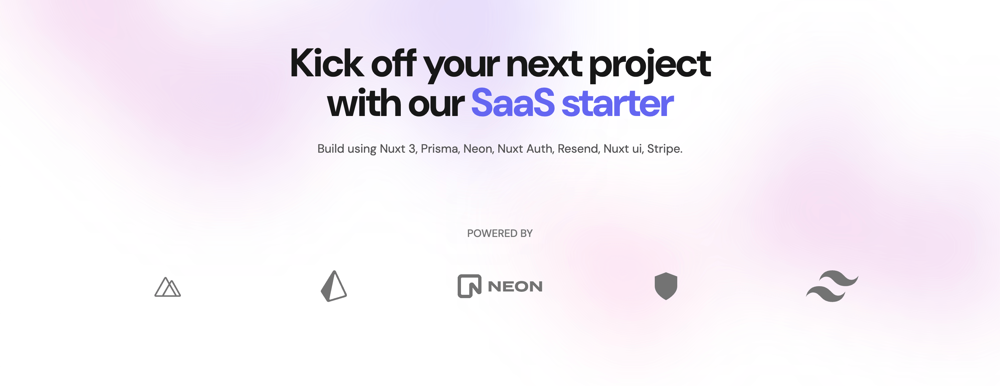

<a href="https://next-saas-stripe-starter.vercel.app">
  
  <h1 align="center">Nuxt 3 - SaaS Stripe Starter</h1>
</a>

<p align="center">
  Build and deploy your Nuxt SaaS within minutes !
</p>

## Introduction

Nuxt SaaS Stareter is a **open source boilerplate** and will help you to create your own SaaS website with Nuxt.js. It is built with Nuxt 4, Nuxt UI and Nuxt Content. It is a perfect starting point for your next project.

This template is inspired by:

- [Next SaaS Stripe Starter](https://github.com/mickasmt/next-saas-stripe-starter) - GitHub repository

[The documentation](https://nuxt-saas-stripe-starter.vercel.app) is your go-to resource for configuring and using the starter effectively.

Let's get started and happy coding!

## Installation

- You can start a fresh new project by cloning the repository from GitHub. Run the following command in your terminal

```bash
git clone https://github.com/devstack-be/nuxt-saas-stripe-starter
```

- Or, deploy with Vercel:

[](https://vercel.com/new/clone?repository-url=https%3A%2F%2Fgithub.com%2Fdevstack-be%2Fnuxt-saas-stripe-starter)

### Steps

- Install dependencies using pnpm:

```sh
pnpm install
```

- Copy `.env.example` to `.env.local` and update the variables.

```sh
cp .env.example .env.local
```

- Start the development server:

```sh
pnpm run dev
```

> [!NOTE]  
> Let's check the [configuration](https://nuxt-saas-stripe-starter.vercel.app/docs/getting-started/authentification) part for update all environment variables before use `pnpm run dev`

## Roadmap

- [ ] Add user Roles
- [ ] Add Admin panel

## Tech Stack + Features

### Stack

- [Nuxt 4](https://nuxt.com) - The Intuitive Vue Framework
- [Prisma ORM](https://prisma.io) - Next-generation ORM for Node.js & TypeScript | PostgreSQL, MySQL, MariaDB, SQL Server, SQLite, MongoDB and CockroachDB
- [Sidebase Nuxt Auth](https://sidebase.io/nuxt-auth) - Effortlessly connect your Nuxt 3 application with Google, Github, Azure and countless others.
- [Stripe](https://stripe.com) - Online payment processing for internet businesses

### UI

- [Nuxt UI / TailwindCSS](https://ui.nuxt.com/) – A UI Library for Modern Web Apps
- [Nuxt Image](https://image.nuxt.com/) – Optimized Images for your Nuxt Apps
- [Pinia Nuxt](https://nuxt.com/modules/pinia) – The Vue Store that you will enjoy using
- [Nuxt Content](https://content.nuxt.com/) – Create a powerful data layer for your application. Use Vue components in Markdown with the MDC syntax.
- [Nuxt OG Image](https://nuxt.com/modules/og-image) – Generate OG Images with Vue templates in Nuxt.

### Platforms

- [Vercel](https://vercel.com/) – Easily preview & deploy changes with git
- [Resend](https://resend.com/) – A powerful email framework for streamlined email development
- [Neon](https://neon.tech/) – Serverless Postgres with autoscaling, branching, bottomless storage and generous free tier.

### Hooks and Utilities

- `nFormatter` – Format numbers with suffixes like `1.2k` or `1.2M`
- `withoutTrailingSlash` - Remove trailing slashes from URLs
- `hasTrailingSlash` - Check if a URL has a trailing slash

### Code Quality

- [TypeScript](https://www.typescriptlang.org/) – Static type checker for end-to-end typesafety
- [ESLint](https://eslint.org/) – Pluggable linter for Next.js and TypeScript

### Miscellaneous

- [Vercel Analytics](https://vercel.com/analytics) – Track unique visitors, pageviews, and more in a privacy-friendly way

## Author

Created by [@devstack-be](https://www.devstack.be) in 2024, released under the [MIT license](https://github.com/devstack-be/nuxt-saas-stripe-starter/blob/main/LICENSE.md).

## Credits

This project was inspired by [Next SaaS Stripe Starter](https://github.com/mickasmt/next-saas-stripe-starter) and built with [Nuxt UI SaaS]([https://github.com/mickasmt/next-saas-stripe-starter](https://github.com/nuxt-ui-templates/saas))

This project was also inspired by shadcn's [Taxonomy](https://github.com/shadcn-ui/taxonomy), Steven Tey’s [Precedent](https://github.com/steven-tey/precedent), and Antonio Erdeljac's [Next 13 AI SaaS](https://github.com/AntonioErdeljac/next13-ai-saas).

- Shadcn ([@shadcn](https://twitter.com/shadcn))
- Steven Tey ([@steventey](https://twitter.com/steventey))
- Antonio Erdeljac ([@YTCodeAntonio](https://twitter.com/AntonioErdeljac))
